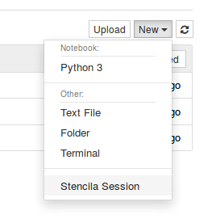

# jupyter-dar

[Jupyter](https://jupyter.org/) + [DAR](https://github.com/substance/dar) compatibility exploration for running [Stencila](http://stenci.la/) on [binder](https://mybinder.org/)

## Demo

Click on the button below to launch an online Jupyter instance on [mybinder.org](https://mybinder.org) based on this repository:

[](https://mybinder.org/v2/gh/minrk/jupyter-dar/master?urlpath=%2Fstencila%2F)

Open an the example Dar archive by clicking on "New > Stencila Session":



## About

This project is part of the [eLife  Innovation Sprint 2018](https://elifesci.org/innovationsprint2018) and [Mozilla Global Sprint 2018](https://mozilla.github.io/global-sprint/) (see [https://github.com/mozilla/global-sprint/issues/317](https://github.com/mozilla/global-sprint/issues/317))

This project comprises two modules:

- a JavaScript package for installing and running Stencila (client/UI and services) in a Jupyter container
- a Python package for installing and running a proxy (based on [`nbserverproxy`](https://github.com/jupyterhub/nbserverproxy)) to access the UI as well as services provided by Stencila; the package also extends the Jupyter UI to add a "New Stencila Session" button

## Team

- [@minrk](https://github.com/minrk)
- [@nuest](https://github.com/nuest)

## How?

### Running Stencila in the Jupyter container

We first used Stencila's development build to run the app using `node make -w -s -d /our/own/dir`, but struggled a bit to configure the file storage, i.e. the `dar-server`, to use the directory we want to, and to run it in a full path configured by us instead of `make.js` starting the `dar-server` relative to `__dirname`.
_Eventually_ we ended up implementing our own minimal npm package that pulls in Stencila as a dependency and runs the `dar-server` and static file server for the app using the files from the `dist` directory.
See the file `stencila.js` for details.
This gives us control of the paths and let's us get rid of complex development features (`substance-bundler` etc.).

We also made our own version of `app.js`, getting rid of the virtual file storage stuff (`vfs`), defaulting storage to `fs` (file system), because that is what is needed for Jupyter - we do not need to host any examples.
In the same line, we built own `index.html` (based on `example.html`) and serve that, which allows us to directly render a DAR document instead of a listing of examples and instruction and to use our `app.js`.

Relevant path configurations comprise the local storage path _as well as_ the URLs used by the client, accessing the `dar-server` through the `nbserverproxy`.

The `Dockerfile` installs our helper npm package and adds + configures the `nbserverproxy` tool (see `requirements.txt` and `jupyter_notebook_config.py`).

### Connecting Stencila to Jupyter kernels

Stencila has "execution contexts" (the equivalent of Jupyter's "kernels") for R, Python, SQL, Javascript (in the browser), and Node.js. Execution contexts differ from kernels in a number of ways including local execution and dependency analysis of cells. Both of these are necessary for the reactive, functional execution model of Stencila Articles and Sheets.

We could install these execution contexts in the Docker image. However, Stencila also has a `JupyterContext` which acts as a bridge between Stencila's API and Jupyter kernels. So, since the base `jupyter/minimal-notebook` image already has a Jupyter kernel for Python installed it we decided to use that. This does mean however, that some of the reactive aspects of the Stencila UI won't work as expected. Also the `JupyterContext` is not well developed or tested.

We have included the [`stencila-node`](https://www.npmjs.com/package/stencila-node) Node.js package in the Docker image which provides the `JupyterContext` as well as a `NodeContext` (for executing Javascript) and a `SqliteContext` (for executing SQL) .

### Making Stencila available via a Proxy

**nbstencilaproxy** provides Jupyter server and notebook extensions to proxy Stencila.
It is based on [**nbrsessionproxy**](https://github.com/jupyterhub/nbrsessionproxy) but does not include the support nbrsessionproxy has for JupyterLab.

**Install**

Install package:

```
pip install git+https://github.com/nuest/nbstencilaproxy
```

Install the extensions for all users on the system:

```
jupyter serverextension enable  --py --sys-prefix nbstencilaproxy
jupyter nbextension     install --py --sys-prefix nbstencilaproxy
jupyter nbextension     enable  --py --sys-prefix nbstencilaproxy
```

The Dockerfile contains an example installation on top of [jupyter/r-notebook](https://github.com/jupyter/docker-stacks/tree/master/r-notebook).

## Development

- Build the Docker image:

```bash
docker build --tag jupyter-dar .
```

- Run the Docker image:

```bash
docker run -p 8888:8888 jupyter-dar
```

- Login by visiting the tokenized URL displayed e.g. `http://localhost:8888/?token=99a7bc13...`

- Go to http://localhost:8888/stencila/ or click on the "New > Stencila Session" button on the Jupyter start page

## License

BSD 3-Clause License
